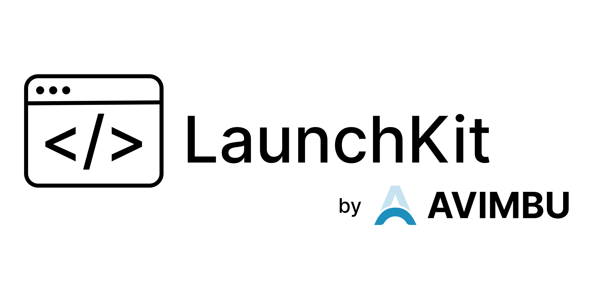

# LaunchKit: The Smart CLI for Rapid Project Setup

## Introduction

Starting a new software project can be exciting, but let’s face it—it’s often bogged down by repetitive setup tasks. From choosing a tech stack to configuring a database, the initial steps can feel more like hurdles than stepping stones.

That’s where LaunchKit comes in. Imagine answering a few straightforward questions and getting a fully functional software project tailored to your needs. Yes, it’s that simple.

## What is LaunchKit?

LaunchKit is a straight forward CLI tool designed for developers and software engineers who want to save time without compromising on quality. It generates ready-to-deploy projects in Rails 8 or Laravel 11, complete with database configurations and optional team support. It's a boilerplate tool which takes it a step further than a standard boilerplate template. The tool uses AI to craft an initial database model that aligns with your project’s requirements. Ready to be used by you. Easily extendable. LaunchKit CLI also follows industry standards for how a database model should be structured and incorporates them into it's generation process.

## How Does It Work?
Using LaunchKit is as intuitive as it gets. It's build with simplicity in mind. LaunchKit aims to get you started in no time with all the necessary pieces already setup for you. Here’s a quick walkthrough of the steps launchkit execute when calling the `create` command:

- Name Your Project: Provide a name that captures your vision.
- Describe It: A short description helps tailor the database and features.
- Pick Your Tech Stack: Rails or Laravel? The choice is yours.
- Choose a Database: PostgreSQL, SQLite, or MySQL—pick what suits you.
- Team Support: Decide if you need multi-user functionality.
- Review and Confirm: See a summary of your choices and make changes if needed.
- Generate: Watch as your project is created in moments!

## Why Developers Love LaunchKit

LaunchKit saves you valuable time by eliminating the need for tedious boilerplate setup, allowing you to jump straight into coding. Its AI-powered customization ensures that your database models are tailored to your project’s specific needs, reducing the guesswork involved in manual configuration. The tool’s flexibility accommodates various technology stacks and databases, making it adaptable to different project requirements. Moreover, its user-friendly, interactive prompts make it accessible even for beginners, guiding you seamlessly through the setup process.

## Example: LaunchKit in Action
This is a complete example workflow how LaunchKit can be used to create your first project:

#### Installation
In order to use LaunchKit, you first need to install it. This can be done by downloading the binary directly from our homepage or by installing it via HomeBrew: 

```(bash)
$ brew install avimbu/launchkit
```

You can check a successful installation by calling: 

```(bash)
$ launchkit version
LaunchKit v1.0.0 by AVIMBU

Registered to: Not yet authenticated
```

#### Authentication

As LaunchKit uses server side code generation, it's required to authenticate the CLI first. You can do this by copying your personal API key from our homepage and calling the authentication command: 

```(bash)
$ launchkit authenticate <YOUR_PERSONAL_API_KEY>
```

You can check a successful authentication by calling: 
```(bash)
$ launchkit version
LaunchKit v1.0.0 by AVIMBU

Registered to: John Smith (1/1/2025)
```

If your name is shown, the authentication process was successful.

#### Creation

Now the interesting part starts: The actual project generation. This is an example which creates a blog sharing platform: 

```(bash)
$ launchkit create

Welcome to LaunchKit! Let’s create your new project.
What is the name of your project?
> BlogMaster

Describe your project in a few sentences. This helps us tailor the database and features to your needs.
> A platform for bloggers to write and share content.

Which technology stack do you prefer?
1. Rails 8
2. Laravel 11
> 1

Which database do you prefer for your project?
1. PostgreSQL
2. SQLite
3. MySQL
> 1

Does your project need support for teams? (yes/no)
> yes

Here’s a summary of your project:
- Name: BlogMaster
- Description: A platform for bloggers to write and share content.
- Stack: Rails 8
- Database: PostgreSQL
- Team Support: Yes
Does this look correct? (yes/no)
> yes
```

In moments, BlogMaster is ready to go, complete with Rails scaffolding and a PostgreSQL database.

#### Optional: Deployment

Optionally, LaunchKit also support deployment of your project to different hosting services. For Rails, LauchKit offer support for Kamal, Dokku and Heroku. For Laravel, LaunchKit offers support for Dokku and Heroku.

A detailed explanation about how to deploy your LaunchKit project can be found in the next article.

## Who Is LaunchKit For?

Whether you’re a startup founder, a freelancer juggling multiple projects, or a small development team looking to streamline workflows, LaunchKit is the tool you didn’t know you needed.

## Looking Ahead

LaunchKit is just getting started. We’re exploring features like API integrations, real-time project monitoring, and more. Our vision? To make project setup so seamless that developers can focus entirely on building.

## Try It Now

Stop spending hours on setup. With LaunchKit, your next project is just a few commands away. Ready to see the magic? Download LaunchKit and get started today.

