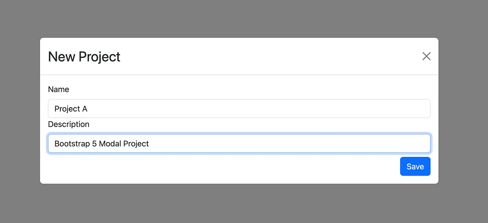
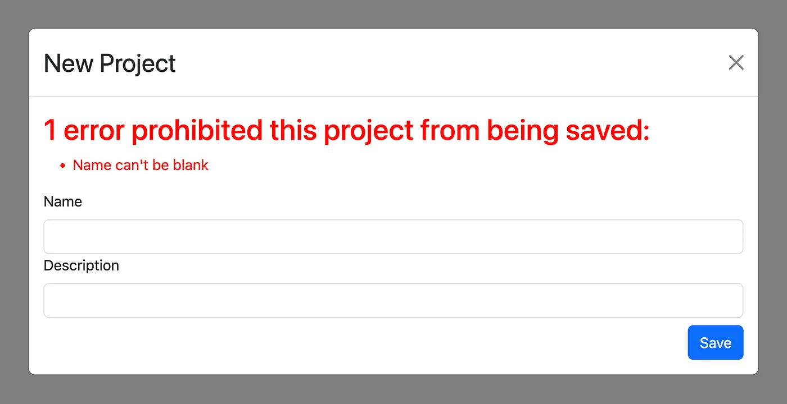

Integrating Bootstrap 5 Modals with Ruby on Rails 7 Using Turbo Frames
======================================================================

Introduction
------------

In my journey to build a new [Ruby on Rails 7](https://guides.rubyonrails.org/) app, I aim to create something as modern and reactive as a [Single Page Application (SPA)](https://en.wikipedia.org/wiki/Single-page_application) written in React. The project I’m currently working on, named [AVIMBU](http://avimbu.com), can be explored further [here](http://avimbu.com).

A common feature in SPAs is the use of modals. My goal was to find a simple yet powerful and flexible approach to integrate Bootstrap modals without adding them permanently to the DOM, only revealing them upon a button click. Fortunately, [Turbo Frames](https://turbo.hotwired.dev/handbook/frames) offer a solution to transfer HTML over the wire, allowing us to display modals without rerendering the entire page.

This blog post provides a step-by-step guide on integrating a [Bootstrap 5 modal](https://getbootstrap.com/docs/5.3/components/modal/#examples) in a Ruby on Rails 7 application using Turbo Frames, thus enhancing your application’s interactivity without full page reloads.


Ruby On Rails

Section 1: Initial Project Setup
--------------------------------

In order to create a barebones Rail 7 project with Bootstrap preconfigured, run the following command:

```
rails new bootstrap\_modal --css=bootstrap -j=esbuild
```

This command creates a Rails project with the latest version of Bootstrap preconfigured. For JavaScript packaging, we will use `esbuild` , which is straightforward and simple to use. You could also opt for using `webpacker` or the more modern `import_maps` approach, however, for now it’s easiest to stick with `esbuild` due to it’s straight forward integration of Bootstrap.

After project creation, navigate to the project directory and start it with:

```
bin/dev 
```

Your application should now be available at `localhost:3000`.

This initial setup comes with Turbo enabled. Verify this by checking for the following line in `app/javascript/application.js`:

```
import "@hotwired/turbo-rails"
```

Section 2: Add a Turbo Frame Tag
--------------------------------

In order to achieve a reactive and modern-feeling web application, we’ll utilize Turbo Frames. Turbo Frames, a key component of Hotwire, allow us to define which parts of an application’s HTML should be replaced, rather than doing a full page reload.

To use them, add the following line to a view file:

```
 <%= turbo\_frame\_tag "modal", target: "\_top" %>
```

I added this line to my `application.html.erb` file, right above the `<%= yield %>` part. This allows for adding my modal HTML element to this frame. The `turbo_frame_tag` creates a `div` element with the class set to `modal`, which Turbo uses to replace the content of this div with the new Turbo Frame content. The `target: "_top"` attribute allows for conventional redirects (e.g., on model creation).

Section 3: Add a Modal Partial
------------------------------

From the Bootstrap documentation, you can find some skeleton Bootstrap 5 modal examples [here](https://getbootstrap.com/docs/5.3/components/modal/#examples). I used one of them and created a `_modal.html.erb` partial for later reuse. Ensure to copy an "active" modal instead of a hidden one. The partial looks like this:

```
<%= turbo\_frame\_tag "modal" do %>  
  <div class="modal fade" tabindex="-1" data-controller="modal">  
    <div class="modal-dialog modal-dialog-centered modal-lg">  
      <div class="modal-content">  
        <div class="modal-header">  
          <div class= "modal-title fs-3">  
            <%= title %>  
          </div>  
          <button type="button" class="btn-close" data-bs-dismiss="modal" aria-label="Close"></button>  
        </div>  
        <div class="modal-body" id="remote\_modal\_body" >  
          <%= yield %>  
        </div>  
      </div>  
    </div>  
  </div>  
<% end %>
```

Section 4: Stimulus Controller for Background Handling
------------------------------------------------------

Since the Bootstrap modal relies on some JavaScript logic, I added a few lines of JavaScript to ensure proper background handling. For this, I chose to use a Stimulus controller as it’s the easiest solution for handling JavaScript within a modern Rails 7 application with Turbo. The controller looks like this:

```
import { Controller } from "@hotwired/stimulus"  
import { Modal } from "bootstrap";  
  
// Connects to data-controller="modal"  
export default class extends Controller {  
  connect() {  
    let backdrop = document.querySelector(".modal-backdrop");  
    if (backdrop) {  
      backdrop.remove();  
    }  
    this.modal = new Modal(this.element);  
    this.modal.show();  
    this.element.addEventListener("hidden.bs.modal", (event) => {  
      this.element.remove();  
    });  
  }  
}
```

As seen in my `_modal.html.erb` partial, I've added the `data-controller="modal"` parameter to link this Stimulus controller with the modal HTML. This controller ensures that the modal backdrop is handled correctly by properly removing and showing the Modal element.

Section 5: Adapt Controller Actions to Use Turbo Frames
-------------------------------------------------------

Here’s the crucial part of integrating Turbo Frames into our Controller actions. I created a simple example scaffold for some model logic:

```
rails g scaffold project name description
```

This command creates all necessary controllers, models, and views to create, update, or delete Project models. Change your root route to the index action of the Project controller by adding this to `routes.rb`:

```
root "projects#index"
```

Now, when you open your application, you’ll see the index page of the Project model, allowing you to create some Project models. However, the new and edit actions redirect to their respective `.html.erb` pages. We want them to open within a modal. This can be done by adapting the view files as follows:

```
<%= render 'partials/modal', title: "New Project", fade\_in: true do %>  
  <%= render "form", project: @project %>  
<% end %>
```

Do the same for the `edit.html.erb` file. Now, when you try to create or edit a model, the view renders within a Bootstrap modal 🥳

Section 6: Add Form Error Handling
----------------------------------

If you add model validations, such as requiring a name, you might notice that errors are not properly handled within the modal.

```
class Project < ApplicationRecord  
  validates :name, presence: true  
end
```

In order to improve this, we need to change how the controller responds in case of an error for both the create and update actions:

```
\# POST /projects or /projects.json  
def create  
  @project = Project.new(project\_params)  
  
  if @project.save  
    redirect\_to project\_url(@project), notice: "Project was successfully created."  
  else  
    render :form\_update, status: :unprocessable\_entity  
  end  
end  
  
\# PATCH/PUT /projects/1 or /projects/1.json  
def update  
  if @project.update(project\_params)  
    redirect\_to project\_url(@project), notice: "Project was successfully updated."  
  else  
    render :form\_update, status: :unprocessable\_entity  
  end  
end
```

This adds a custom `render` response for error cases, instructing the controller to render the `form_update` view. This view will update the modal's body via a Turbo Stream (see [Turbo Streams documentation](https://turbo.hotwired.dev/handbook/streams)) to show the correct error and avoid a full page reload. The `form_update.turbo_stream.erb` file looks like this:

```
<%= turbo\_stream.update "remote\_modal\_body" do %>  
  <%= render "form", project: @project %>  
<% end %>
```

Now, if you try to save a Project model without a name, the erorr is shown within the modal:


Modal with Error

That’s it! We’ve successfully implemented a Bootstrap modal using Turbo Frames, making our Rails 7 application feel more responsive and modern.

Conclusion
----------

The final product should look like this:


Final Product

We’ve covered how to integrate a Bootstrap 5 modal in a Ruby on Rails 7 application using Turbo Frames. This integration allows for a more dynamic and responsive user interface without the need for full page reloads. Experiment with Turbo Frames and Bootstrap modals, and feel free to share your experiences or ask questions in the comments below.

If you want to know more about me, feel free to check out my [homepage](http://michaelwapp.com) or follow me on Twitter [here](https://twitter.com/michael_wapp).


Bootstrap 5 — a developer friendly CSS component library

Additional Resources
--------------------

The code used in this tutorial can be found [here](https://github.com/michaelwapp/bootstrap_modal_turbo_frame).

Alternative resources:

*   [Ruby on Rails Guidelines](https://guides.rubyonrails.org/)
*   Bootstrap [documentation](https://getbootstrap.com/)
*   [Rails Hotwire](https://hotwired.dev/)
