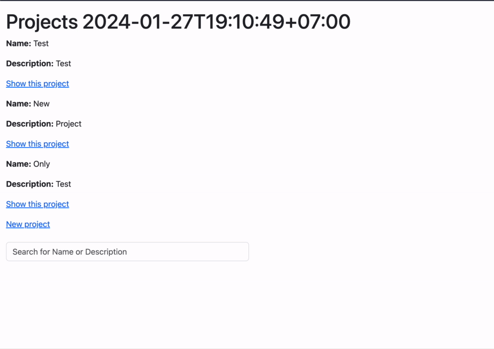

# Implementing Dynamic Search with Turbo Frames in Ruby on Rails 7

### Introduction

In web development, a responsive and efficient search experience is key to user satisfaction. For my recent project at [AVIMBU](http://avimbu.com), I implemented a search feature that queries both local data and external APIs. This was achieved using Hotwire's TurboFrames in a Ruby on Rails 7 web application.

In this blog post, I'll guide you through implementing a dynamic search bar that fetches data both locally and from an external source (such as an API), all without a full page reload thanks to TurboFrames. 

### Section 1: Initial Project Setup 

As we are building a dynamic search implementation for a Ruby on Rails 7 project, we need a few steps to setup the initial project state. For this, run the following command: 

```
rails new dynamic_search --css=bootstrap -j=esbuild
```

This command creates a Rails project with the latest version of Bootstrap pre-configured (this is optional but provides better styling). For JavaScript packaging, we will use `esbuild` , which is straightforward and simple to use. You could also opt for using `webpacker` or the more modern `import_maps` approach, however, for now it’s easiest to stick with `esbuild` due to it’s straight forward integration of Bootstrap.

After project creation, navigate to the project directory and start it with:

```
bin/dev 
```

Your application should now be available at `localhost:3000`.

This setup includes Turbo by default, a key component for dynamic page updates. Confirm its inclusion in `app/javascript/application.js`:

```
import "@hotwired/turbo-rails"
```

### Section 2: Implementing the Search Feature

Begin by creating a Project model with `name` and `description` attributes. Use Rails' scaffolding to quickly set up the model and its CRUD operations:

```bash
rails g scaffold project name description
```
Once that's done, you should be able to create, update and delete some project model entities within your application. 

Let's add the search function: I've chosen the `index` action of the ProjectsController. Therefore I've added a search form to the corresponding view template: 
 
```html 
<%= form_with url: projects_path, method: :get, data: { turbo_frame: 'project_listings' } do |form| %>
    <%= form.search_field :q, class: 'form-control', placeholder: "Search for Name or Description" %>
<% end %>
```

This add's a simple search bar which allows us to submit a `GET` search request against the `projects#index` action. The search query is provided via the `q` parameter. I've adapted the `index` action as follows: 

```ruby
def index
  @projects = Project.all
  @search = params[:q]
  @results = if @search.blank?
    []
  else
    Project.where('name LIKE :search OR description LIKE :search', search: "%#{@search}%")
  end
end
```

After this change, I have two new variables which are accessible within the `index` view. `@search` holds the search query and `@results` holds an array of found Project models. For the sake of demonstration, I've implemented the database search using a simple `LIKE` based search query. This can and should be improved by using better implementations such as [pg_search](https://github.com/Casecommons/pg_search).

The `app/views/projects/index.html.erb` also needs some changes:


```erb
<%= turbo_frame_tag 'project_listings' do %>
    <% unless @results.empty? %>
        <% @results&.each do |project| %>
            <div class="p-2 border">
                <div class="fs-6">Name: <%= project.name %> - Description: <%= project.description %></div>
            </div>
        <% end %>
    <% end %>
<% end %>
```
I've wrapped the search results in a `turbo_frame_tag` with the same ID as the form submits to. Therefore, Turbo is smart enough to figure out which part of the DOM needs to change and only updates the `project_listings` `turbo_frame_tag` to avoid a full page refresh. 

No, if the local DB search returns some results, the search results are shown without the need of a full page refresh. 

### Section 3: Integration of External Search

The first search part is now implemented. Now, let's add some external search functionality to incorporate an external API for my search results in case the local search doesn't provide the results I'm looking for. For this, I'm using the concept of lazy-loading `turbo_frame_tags`. This allows me to trigger / load the source action of a TurboFrame as soon as the frame is visible in the viewport.

I have to change three things to make it work. First, add the `turbo_frame_tag` within the first search result TurboFrame s.t. it's always reloaded when the first TurboFrame is reloaded. Ensure that the `src` option is pointing to the external search action, which we are now going to add. For this, add the following route to your `routes.rb` file: 

```ruby 
get 'projects/external_search_project' => 'projects#external_search_project', as: :load_external_search_project
```

Also, add this method (action) to the projects controller: 

```ruby
def external_search_project
    return if params[:q].blank? || params[:avoid_search] == "true"

    sleep 1.0 # simulate external request
    @external_search_result = [Project.new(name: "External Project", description: "Loaded from wherever")]
end
```

It's an example implementation where the external search request is simulated using `sleep`. Also, the action is skipped if no search query is passed or an `avoid_search` param is given. 

Finally, add the external search TurboFrame inside the first TurboFrame to ensure that it's always loaded with a regular search update. By passing the search query and setting the `avoid_search` parameter depending on whether local search results are available or not, the external search is only triggered accordingly. This allows for only executing and rendering external search results if local search didn't provide any results. 


```erb
<%= turbo_frame_tag 'project_listings' do %>
    <% unless @results.empty? %>
        <% @results&.each do |project| %>
            <div class="p-2 border">
                <div class="fs-6">Name: <%= project.name %> - Description: <%= project.description %></div>
            </div>
        <% end %>
    <% end %>
    <%= turbo_frame_tag 'external_search_result', src: load_external_search_project_path(q: @search, avoid_search: @results.any?), loading: :lazy do %>
    <% end %>
<% end %>
```

Also, to update the `external_search_result` TurboFrame, add this view template to `app/views/projects/external_search_project.html.erb`. This will be rendered on external search and lists the external search results if they are available. 


```html
<%= turbo_frame_tag "external_search_result" do %>
  <% @external_search_result&.each do |project| %>
    <div class="p-2 border">
      <div class="fs-6">Name: <%= project.name %> - Description: <%= project.description %></div>
    </div>
  <% end %>
<% end %>
```

That's it. Now you have control over your search behavior. This allows you to adapt the search implementation to your needs. 

The final product should look like this: 



### Section 4: Improvement: Form Auto-Submission 

Enhance the search experience with automatic form submission. Use a Stimulus controller to submit the form after a brief delay. Attach the controller to the form as follows:

```javascript
import { Controller } from "@hotwired/stimulus"

export default class extends Controller {

  search() {
    clearTimeout(this.timeout)
    this.timeout = setTimeout(() => {
      this.element.requestSubmit()
    }, 300)
  }
}
```
You also need to attach this controller to the search form like this: 

```html 
<%= form_with url: projects_path, method: :get, data: { controller: "formsubmission", turbo_frame: 'project_listings' } do |form| %>
    <%= form.search_field :q, class: 'form-control', placeholder: "Search for Name or Description", data: { action: "input->formsubmission#search" } %>
<% end %>
```

Now, after this addition, the form submits automatically after 300ms. 

### Conclusion

Utilizing TurboFrames in this manner provides an effective solution for dynamic searching in Rails applications.

### Additional Resources

For more insights into TurboFrames and Hotwire, visit the [Hotwire Turbo documentation](https://turbo.hotwired.dev/).

If you want to know more about me, feel free to check out my [homepage](http://michaelwapp.com) or follow me on Twitter [here](https://twitter.com/michael_wapp).

### Additional Resources

The code used in this tutorial can be found [here](https://github.com/michaelwapp/dynamic_search).

Alternative resources:

* [Ruby on Rails Guidelines](https://guides.rubyonrails.org/)
* [Rails Hotwire](https://hotwired.dev/)
