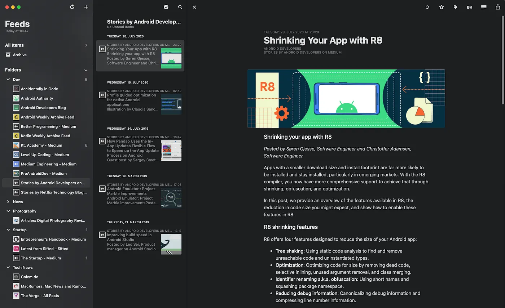
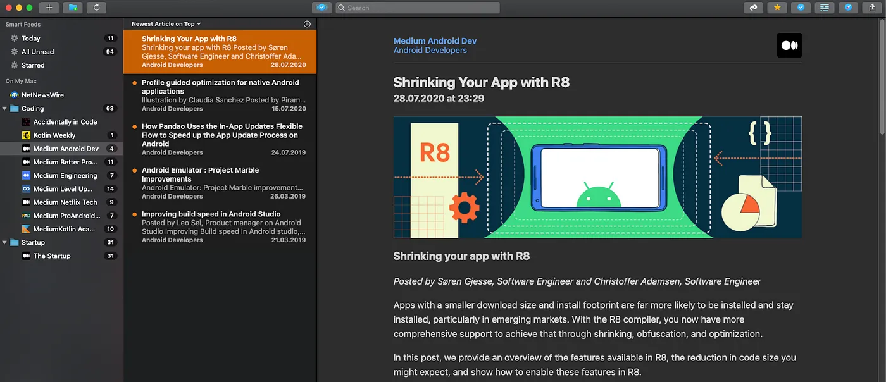
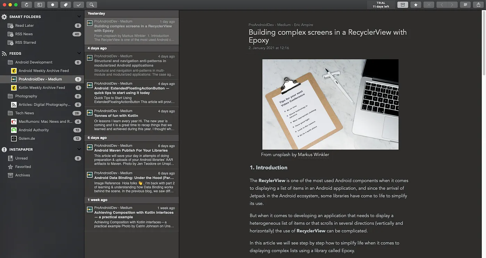
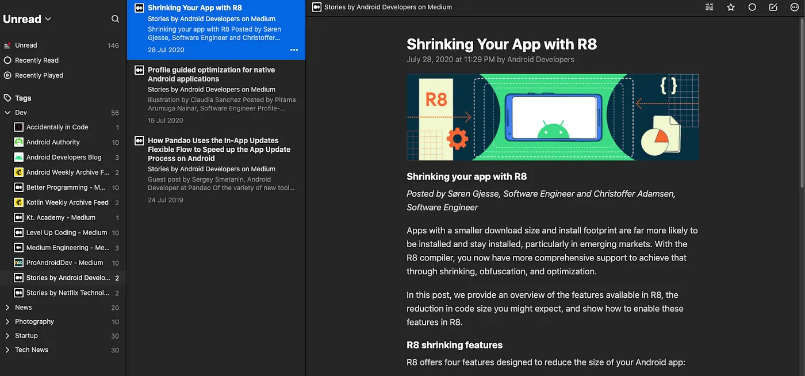
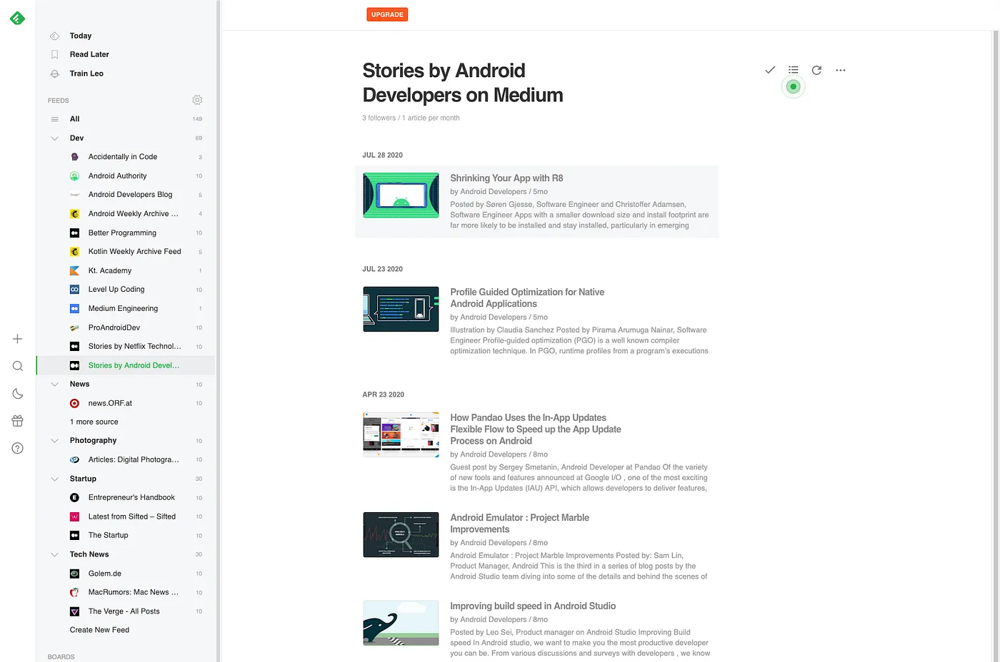

THE most efficient way to consume content from websites, blogs or twitter
=========================================================================

Introduction & Problem
======================

Photo by [AbsolutVision](https://unsplash.com/@freegraphictoday?utm_source=unsplash&utm_medium=referral&utm_content=creditCopyText) on [Unsplash](https://unsplash.com/)

I find myself in a situation where consuming articles and information from the internet which I want to read becomes a tedious and time consuming task. Information is spread across a multitude of sources such as email newsletters, social media sites (e.g. Twitter), general blogs and (news) websites. Rattling off all those information streams daily takes me quite some time I’d rather spend actually consuming or working on other tasks. Therefore, I was on the hunt to find an efficient and more streamlined way to read information on and from the internet.

By trade, I’m a software developer. I try to consume as much technical content as possible in order to stay up to date with all things relevant to my field of development (mobile development — in particular — Android). I have active subscriptions to platform specific newsletters and follow important individuals on Twitter. General industry information (about the latest Apple news for example) is consumed via directly accessing websites such as [macrumors.com](http://macrumors.com). As mentioned, this becomes a tedious ritual scanning through my email inbox, filtering for relevant newsletters and relevant articles. Also, relying on social media such as Twitter to provide me with information about the latest trends in Android development is kind of questionable in the first place. By eliminating the process of accessing websites directly during the day, I protect myself from unnecessary “wander-offs”.

A solution to this problem needs to fulfill the following requirements:

*   Needs to be one central place for all my information consumption.
*   Accessible via all platforms I use (macOS, iOS, (Android as a bonus)) and synchronisation.
*   Quickly adding newly found content (such as RSS feeds, posts, websites)
*   Relatively cheap — free at best — no subscription service
*   Categorization options (e.g. work, private, hobby)

Disclaimer: This article is focused on my device environment i.e. macOS and iOS. I’m sure that there are similar solutions for other platforms such as Linux and Windows.

Photo by [AbsolutVision](https://unsplash.com/@freegraphictoday?utm_source=unsplash&utm_medium=referral&utm_content=creditCopyText) on [Unsplash](https://unsplash.com/)

Solution — WebFeed & WebFeed-Reader
===================================

Mostly forgotten and not as commonly used as it previously was, [WebFeeds](https://en.wikipedia.org/wiki/Web_feed) (such as RSS, Atom or JSON Feed) provide an easy way to consume content from web sources such as news sites, blogs, medium feeds (see [here](https://help.medium.com/hc/en-us/articles/214874118-Using-RSS-feeds-of-profiles-and-publications) for how to access feeds and users via RSS). As new content is published, RSS feeds are populated with the new information. RSS (basically an XML file) can contain content such as title, link, description and images which can be consumed to quickly look at the newly created information and get a quick input about what the new entry is about.

Certainly, this seems like a good way to consume information and content on the internet, but the main benefit of WebFeeds comes when they are combined using a WebFeed reader. There are many solutions online. I tried the following applications and services:

RSS Reader
==========

[**Reeder 5**](https://reederapp.com/) **— Paid (10,99€ MacOS / 4,99€ iOS)**
----------------------------------------------------------------------------

In my opinion, this is the best macOS / iOS solution to consume RSS feeds. It offers a seamless and fluent UI, is highly customizable and allows for connecting relevant third-party services such as [Instapaper](http://instapaper.com/) (more on that later).

The only downside I found is that there are initial costs (16€ for both MacOS and iOS) but in my opinion it is totally worth it. Both macOS and iOS apps are synced using iCloud so all your consumed / read articles are always up to date.

Additional features such as bionic reading are nice to have but not quite essential for me (at least for now).

Overview of the Reeder 5 macOS interface.

The consumption process is quite fast. The macOS app can be navigated using the arrow keys on the keyboard which makes it extremely fast to browse through articles. In case I want to dig deeper most articles are beautifully laid out ready to read. If e.g. source code examples in Medium articles are not rendered as intended, an in-app browser opens the actual article on Medium.

All in all, this is the best pick for people — like me — who are looking for an affordable RSS reader which syncs across devices and is not bound to a subscription service. The nice user interface and additional features as well as the integration with [Instapaper](http://instapaper.com/) make it an optimal choice for my needs. 10/10 can recommend it.

[**NetNewsWire**](https://netnewswire.com/) **— Free(macOS / iOS)**
-------------------------------------------------------------------

The best free solution I found to achieve the basic needs of an RSS reader application is NetNewsWire. Although there is no integration for services like [Instapaper](http://instapaper.com/) it allows you to link your [Feedbin](https://feedbin.com/) or [Feedly](https://feedly.com/) accounts. The user experience is basic and the UI is not as fancy as the animations offered by Reeder 5 but it is functional. Sadly there is no iCloud sync so you cannot share the status of your consumed articles across platforms without using a third-party service such as [Feedbin](https://feedbin.com/) or [Feedly](https://feedly.com/).

All in all, NetNewsWire is a good RSS reader which offers all the basics. The lack of synchronization and integration of services like [Instapaper](http://instapaper.com/) do not make it an optimal pick for my needs.

Overview of the basic NetNewsWire macOS interface.

**ReadKit — Paid (10,99€ macOS)**

ReadKit is an alternative macOS RSS reader which I also tried during my RSS reader search quest. It is also a paid option and offers all basic functions needed for processing different RSS feeds. It offers integration of all relevant third-party services such as [Instapaper](http://instapaper.com/), [Feedbin](https://feedbin.com/), [Feedly](https://feedly.com/) and so on. One downside is that there is no iOS option (which is quite relevant for me). The user interface is basic but fulfills all the requirements of a modern RSS reader. Medium articles for example are shown in a beautiful layout. It also offers a wide range of customizations.

As this reader costs the same as Reeder 5 and offers less functionality I wouldn’t recommend using it. If you really don’t like the user interface of Reeder 5 or don’t care about features such as iCloud synchronization and and iOS app feel free to use this RSS reader as your daily news feed driver.

Overview of the ReadKit macOS interface

WebFeed Services
================

The above mentioned RSS readers are native macOS or iOS applications. As more and more of modern applications move to a browser-based approach, the following list consists of web-based WebFeed reader solutions. Remember that all of these services are subscription based which is not something I fancy.

[**Feedbin**](https://feedbin.com/) **($5/month or $50/year)**
--------------------------------------------------------------

[Feedbin](https://feedbin.com/) is an online service which markets itself as “a nice place to read on the web”. It allows for all the standard features such as subscribing to WebFeeds and reading these articles. Additionally, it offers integrated Twitter and Email Newsletter subscriptions so there is no need to utilize external services such Twitter to RSS and kill the newsletter.

Additionally, [Feedbin](https://feedbin.com/) offers a [Notifier iOS App](https://apps.apple.com/app/feedbin-notifier/id996164128) which can be configured to notify you about information published to your favourite WebFeeds.

Overview of the Feedbin web interface

[**Feedly**](https://feedly.com/)
---------------------------------

[Feedly](https://feedly.com/) is somewhat the same as [Feedbin](https://feedbin.com/) but functions more as a digital information hub which also includes note taking solutions so that feed articles can be annotated with notes (which sync to some note taking services such as Evernote). The overall user experience is really streamlined and reading and consuming information through [Feedly](https://feedly.com/) is an enjoyable task. Nevertheless, the only downside for me is that I don’t want to pay for an active subscription especially if I don’t need all the features Feedly offers.

For someone who is looking for a browser-based solution (i.e. platform independent) and doesn’t mind the subscription fees, [Feedly](https://feedly.com/) would be my top choice as a WebFeed reader.

Overview of the Feedly web interface

Additional tools
================

In order to make the process of consuming internet articles more enjoyable and bringing more information into my WebFeed inbox, I use several tools. Here is a list of my day-to-day used services:

[**Instapaper**](http://instapaper.com/) **(Free / $29,99 per year for premium features)**
------------------------------------------------------------------------------------------

[Instapaper](http://instapaper.com/) is a service which serves as my digital article or website bookmark store. I use it to save things I find on the internet and want to read later on. [Instapaper](http://instapaper.com/) offers a free version (which is more than enough in my opinion) and a Google Chrome extension which allows for quickly saving articles or websites to my Instapaper feed. Optionally, a shortcut can be configured to save websites even faster.

This inbox is then synced to Reeder 5 where I can read saved articles later. [Instapaper](http://instapaper.com/) also offers a subscription service ($2,99/month) with additional features I don’t really need such as full-text search, unlimited notes, text-to-speech playlists and speed reading.

Instapaper Overview

[**Kill the Newsletter**](https://kill-the-newsletter.com/)
-----------------------------------------------------------

If you want to subscribe to a Newsletter that uses RSS but the newsletter doesn’t offer RSS, Kill the Newsletter is here to help you achieve exactly that. It generates a random email address which can then be used to subscribe to the newsletter. Every email sent is then transformed into an RSS feed entry which you can subscribe to.

[**Twitter to RSS**](https://fetchrss.com/twitter)
--------------------------------------------------

If you want to follow your favourite Twitter people using a WebFeed, Twitter to RSS does just the trick. It transforms a Twitter profile URL to a RSS Feed URL which can be subscribed to. This is a very useful tool to avoid having to scroll through Twitter and get distracted. And you can still consume tweets from people you want to follow.

Conclusion
==========

Using the RSS Reader Reeder 5 and additional tools such as [Instapaper](http://instapaper.com/) (to quickly add things from my browser to my read later list), [Kill the Newsletter](https://kill-the-newsletter.com/) (to subscribe to newsletters which do not offer RSS support) and [Twitter to RSS](https://fetchrss.com/twitter) (to subscribe to Twitter profiles I see as source of information instead of a social media outlet) streamlines my information consumption online and saves me quite a lot of time. Also, temptations to wander off into the internet are reduced to a minimum due to a dedicated information consumption solution.

Thanks for reading my first Medium article. If you want, follow me on [Twitter](https://twitter.com/michael_wapp).

Bonus tip
=========

[OPML](https://de.wikipedia.org/wiki/Outline_Processor_Markup_Language) files allow for easy transition of feeds between different services. If you want to try several services I suggest creating an OPML file for your favourite feeds and importing them to the new WebFeed service you want to try.
